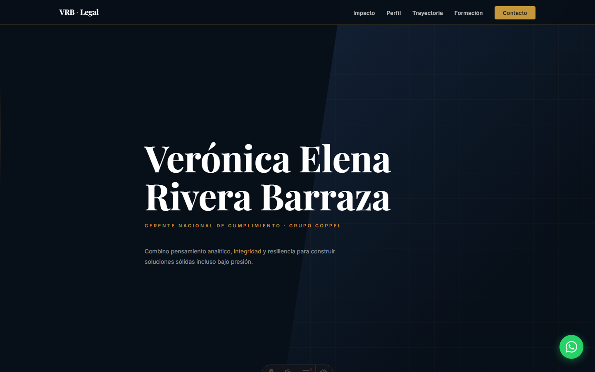

# Verónica Elena Rivera Barraza — Landing Page

Página personal / resume de Verónica Elena Rivera Barraza, abogada con 26+ años de experiencia en cumplimiento corporativo (PLD, anticorrupción e integridad). Construida con Astro, React y Tailwind.

## Funcionalidades

- **Hero** con nombre, credenciales y llamadas a la acción (WhatsApp y LinkedIn).
- **AuthorityBar**: logotipos de empresas e instituciones (Grupo Coppel, Tec de Monterrey, ACAMS).
- **BigNumbers**: métricas clave animadas con contadores.
- **Secciones** de dualidad (liderazgo técnico), formación, hitos y contacto.
- **WhatsApp float**: botón flotante de contacto directo.
- **CV descargable**: `public/cv-veronica-rivera.pdf`.
- Animaciones con Framer Motion (FadeUp).

## Stack

- Astro 4 + @astrojs/react, React 18
- Tailwind CSS (@astrojs/tailwind), Framer Motion
- TypeScript, desplegado en Vercel (`https://vrb.vercel.app`)

## Instalación y ejecución

```bash
npm install
npm run dev       # astro dev
```

Producción:

```bash
npm run build     # astro build
npm run preview   # astro preview
```

## Variables de entorno

No requiere variables de entorno.

## Estructura del proyecto

```
src/
├── components/    # Navbar, Hero, AuthorityBar, BigNumbers, Duality, Formation,
│                  # Milestones, Contact, WhatsAppFloat, Footer, FadeUp
├── data/content.ts  # todo el contenido del sitio (textos, enlaces, métricas)
├── layouts/Layout.astro
├── pages/index.astro
└── styles/global.css
public/            # cv-veronica-rivera.pdf, favicon.svg, logos/
```

Todo el contenido de la página está centralizado en `src/data/content.ts` para edición sin tocar componentes.

## Tests

No hay suite de tests configurada.

## Estado

Desplegado en producción (`vrb.vercel.app`). Repositorio: `HermannPR/VRB`.

## Screenshots


